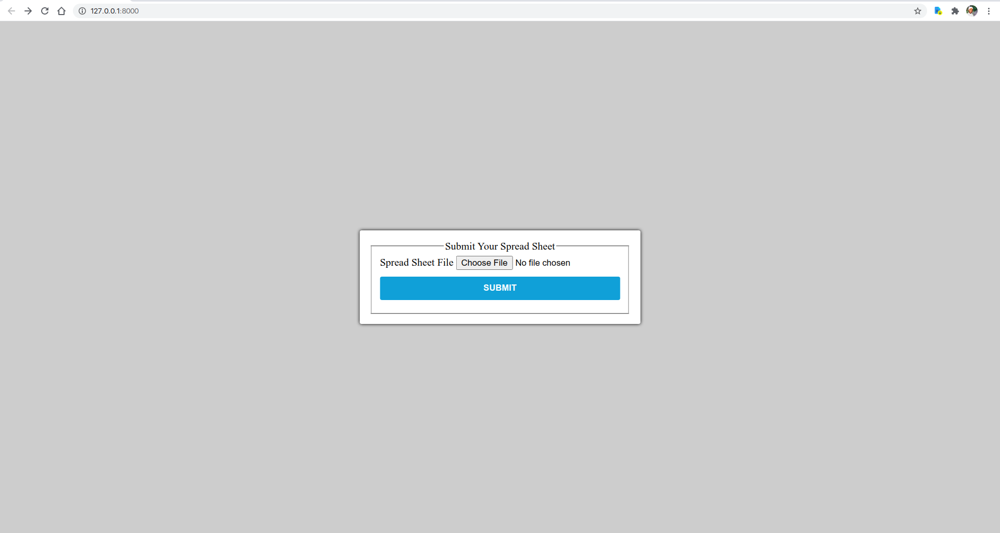
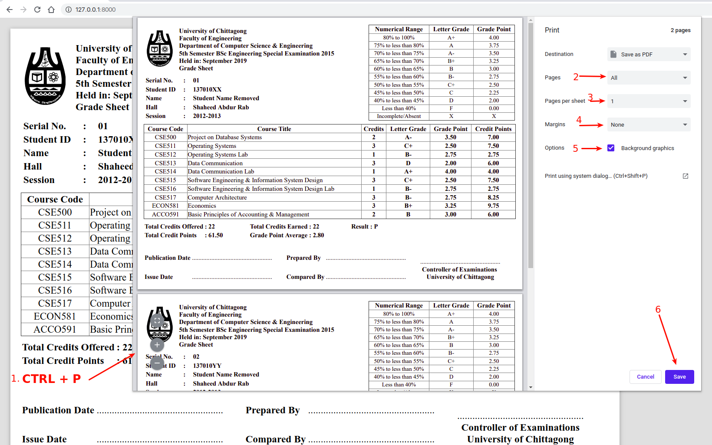

# Excel Sheet to Grade Sheet Generator

This is a special repository for generating grade sheets from pre-calculated spread-sheet.

## Installation

You must have `python v3+` and `pip` packages installed.

- Install `virtualenv`; for example, in **Ubuntu**: `sudo apt install virtualenv`.
- Create a virtual environment: `virtualenv venv`
- Activate the new environment: `source venv/bin/activate`
- Install required packages: `pip install -r requirements.txt`
- Start web server: `python manage.py runserver`
- Now you can open http://127.0.0.1:8000/ in your browser.

## Generate Grade Sheet

- Go to http://127.0.0.1:8000/ using **Google Chrome** web browser.

- Upload your spread-sheet file.
- You will see grade-sheets (in print-friendly HTML) in your browser.

- Press `CTRL + P` to open-up print dialog.
- Save as `PDF` from the print dialog.
- Now you can print the `PDF` file using your favourite printer.

## Format of Spread-Sheet File

The spread-sheet file you use to generate grade-sheets must have following specifications met:

- All contents used for generating the grade-sheets must go to the very first sheet. Note that, a spread-sheet file may contain multiple `sheets`, among them we use the first one only.
- The spread-sheet file must be in one of the following formats:
    - `.ods` -> Open Document Spreadsheet
    - `.xls` -> Microsoft Office Excel 97-2003 Binary File Format
    - `.xlsx` -> Microsoft Excel Open XML Spreadsheet
- The sheet must be in `1NF` normalized form (in terms of database normalization).
- The `sheet` must contain (at least) the following columns with header names exactly as shown (case sensitive, no white-space allowed):
    - `ExamID` -> The examination identity (used in group-by), e.g. `5SBS16r`
    - `TabulationSerial` -> Serial number of the grade-sheet (used in group-by), e.g. `01`
    - `StudentID` -> e.g. `16701016`
    - `StudentName` -> e.g. `Atikur Rahman`
    - `HallName` -> e.g. `Shaheed Abdur Rab`
    - `Session` -> e.g. `2015 - 2016`
    - `CourseNo` -> e.g. `CSE 511`
    - `CourseTitle` -> e.g. `Operating Systems`
    - `Credit` -> Credits for the course, e.g. `3`
    - `LG` -> Letter Grade the student obtained in the course, e.g. `A+`
    - `GP` -> Grade Point the student obtained in the course, e.g. `4.00`
    - `PS` -> Point Secured by the student in the course, e.g. `12.00`
    - `TCO` -> Total Credits Offered for all the courses in the respective examination, e.g. `22`
    - `TCE` -> Total Credits Earned by the student for all the courses in the respective examination, e.g. `22`
    - `TPS` -> Total Points Secured by the student for all the courses in the respective examination, e.g. `84.26`
    - `GPA` -> Grade Point Average for the student for all the courses in the respective examination, e.g. `3.83`
    - `Remark` -> Any remark/comment if exists for the student
    - `Faculty` -> e.g. `Faculty of Engineering`
    - `DepartmentID` -> e.g. `Computer Science and Engineering`
    - `ExamName` -> e.g. `5th Semester B.Sc. Engineering Examination 2018`
    - `ExamHeldIn` -> e.g. `April - July 2018`
    - `Result` -> e.g. `P`
- A sample of such spread-sheet file is given in `sample-data` directory. You can use it as a base.

## Change Grade-Sheet Format

If you want to change the design/layout of grade-sheets then edit the file `app/templates/app/marksheet.html`.
`CSS` stylesheet for the template is `app/static/app/styles.css`.
